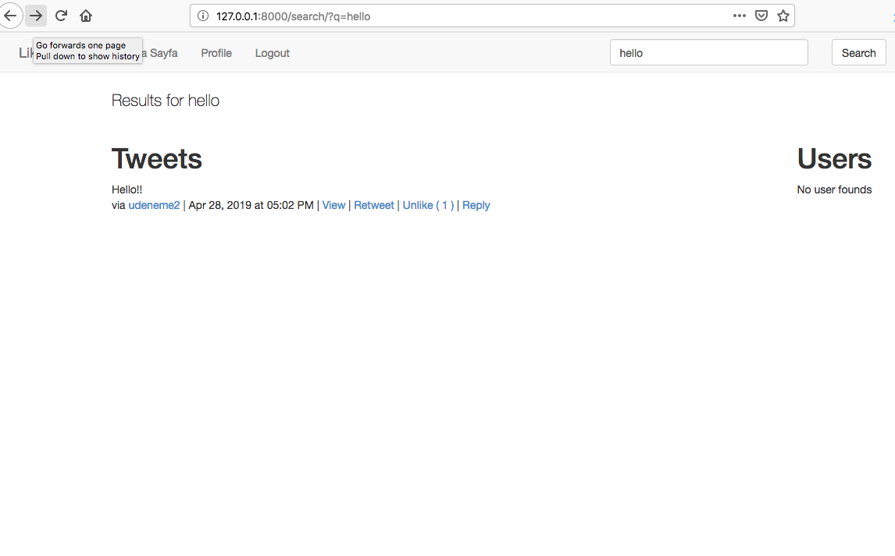
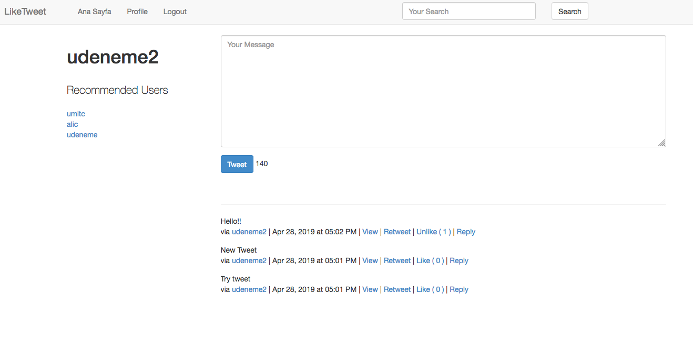
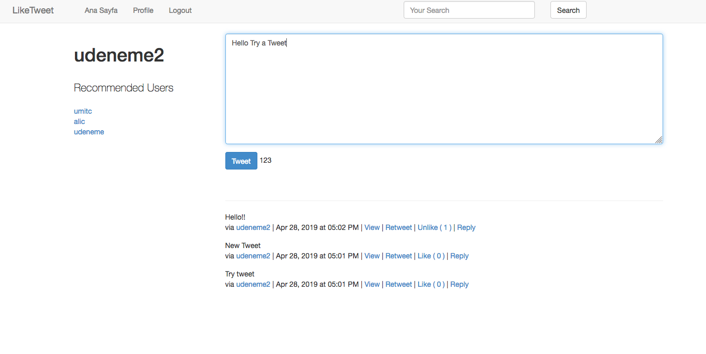
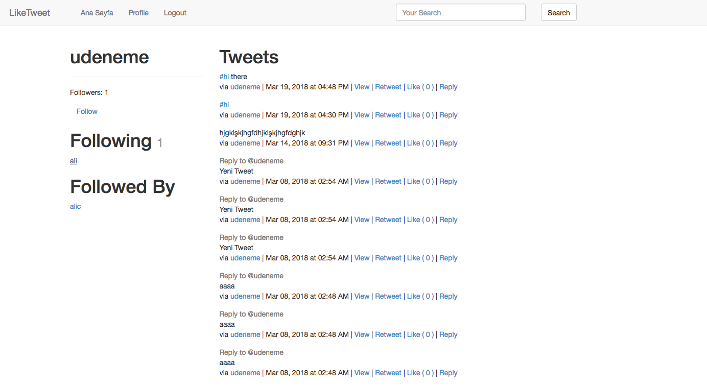

# LikeTweet

Like Twitter. Personal Project to Improve Myself.

### Installation

```sh
virtualenv -p python3 env
source env/bin/activate
cd src
pip install -r requirements.txt
```

```sh
python manage.py makemigraitons
python manage.py migrate
python manage.py createsuperuser
python manage.py runserver 
```

### Screenshots






